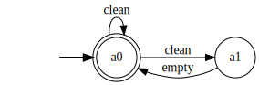
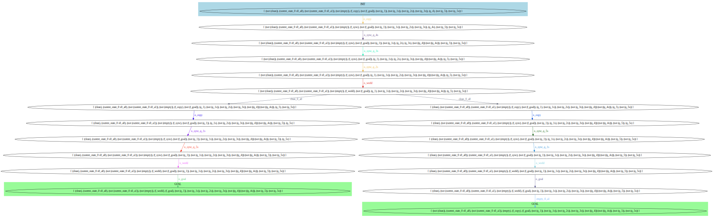
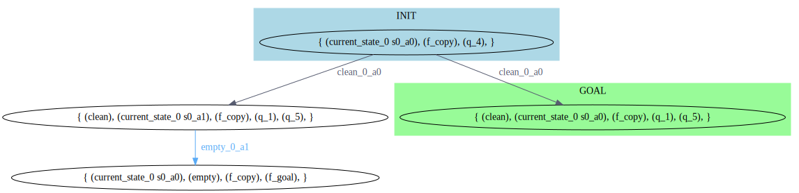
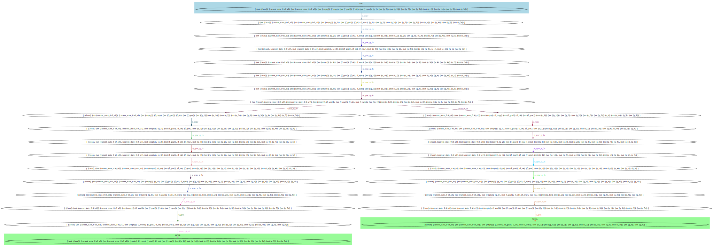
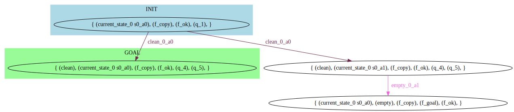
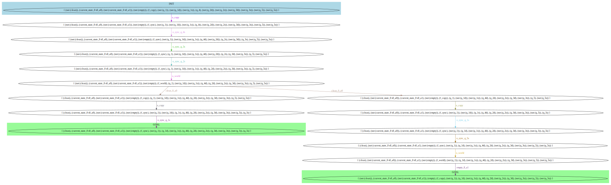
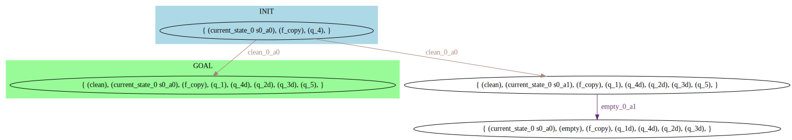
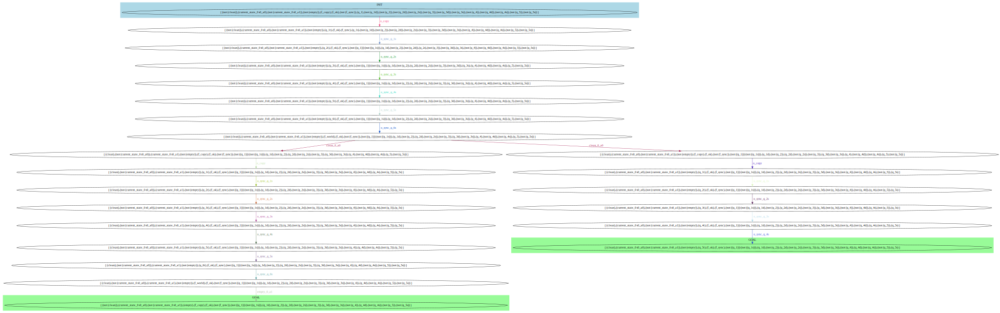
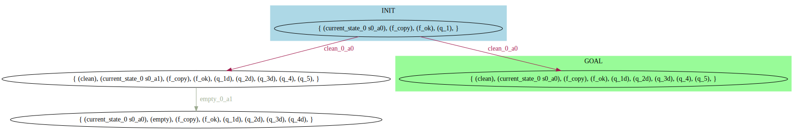

# LTLf Goal-oriented Service Composition

This is the supplementary material for the paper "LTLf Goal-oriented Service Composition".

Link repo: [https://github.com/anonymous4143/icaps-2024-ltlf-goal-oriented-service-composition](https://github.com/anonymous4143/icaps-2024-ltlf-goal-oriented-service-composition)

Link GH page: [https://anonymous4143.github.io/icaps-2024-ltlf-goal-oriented-service-composition](https://anonymous4143.github.io/icaps-2024-ltlf-goal-oriented-service-composition)


In the GitHub version, you won't find code in `prologex` since it must be asked to the authors of the TB's paper to make it public, ask the software to the authors:

    Torres, Jorge, and Jorge A. Baier. "Polynomial-time reformulations of LTL temporally extended goals into final-state goals." Twenty-Fourth International Joint Conference on Artificial Intelligence. 2015.


Table of contents:

- [Preliminaries](#preliminaries)
  - [Main code dependencies](#main-code-dependencies) 
  - [T&B code dependencies](#tb-code-dependencies)
  - [MyND Planner](#mynd-planner)
- [Run experiments](#run-experiments)
- [Print table](#print-table)
- [Tutorial: (Simplified) Garden scenario](#tutorial-simplified-garden-scenario)
  - [Available services](#sg-scenario-available-services)
  - [Goal](#sg-scenario-goal)
  - [PDDL of service community domain and problem](#sg-scenario-pddl-of-service-community-domain-and-problem)
  - [SG scenario: TB encoding (Mode: Simple)](#sg-scenario-tb-encoding-mode-simple)
  - [SG Scenario: Solution (Mode: Simple)](#sg-scenario-solution-mode-simple)
  - [SG scenario: TB encoding (Mode: OSA)](#sg-scenario-tb-encoding-mode-osa)
  - [SG Scenario: Solution (Mode: OSA)](#sg-scenario-solution-mode-osa)
  - [SG scenario: TB encoding (Mode: PG)](#sg-scenario-tb-encoding-mode-pg)
  - [SG Scenario: Solution (Mode: PG)](#sg-scenario-solution-mode-pg)
  - [SG scenario: TB encoding (Mode: OSA-PG)](#sg-scenario-tb-encoding-mode-osa-pg)
  - [SG Scenario: Solution (Mode: OSA-PG)](#sg-scenario-solution-mode-osa-pg)

## Preliminaries

We tested the instructions on Ubuntu 22.04 platform.

### Main code dependencies

- Make sure you have Python 3.11 installed
- Install Pipenv: https://pipenv.pypa.io/en/latest/
- Clone the repository:
```
git clone --recursive https://github.com/marcofavorito/ltlf-goal-oriented-service-composition.git
cd ltlf-goal-oriented-service-composition
```

- Use Pipenv to set up the virtual environment:
```
pipenv shell --python=3.11
pipenv install --dev
```

- In each new terminal, run the following
```
export PYTHONPATH=${PYTHONPATH:+$PYTHONPATH:}$(pwd)
```

### T&B code dependencies

Torres & Baier's software (T&B or TB in short), stored in `prologex`, has been kindly given by the authors.

To use it, you need to install SWI-Prolog.

- Download and install SWI-Prolog: https://www.swi-prolog.org/download/stable. 
  On Ubuntu you can run:
```
sudo apt install swi-prolog
```

### MyND Planner

To use the MyND planner, you have to install Java >=8, <15.

```
cd planners/
git clone https://bitbucket.org/robertmattmueller/mynd.git
```

You can use [SdkMan](https://sdkman.io/):
```
sdk install java 14.0.2-open
sdk install maven 3.9.6
```

Then, build MyND:
```
cd planners/mynd/
./build.sh
```

Apply the Git patch to fix a minor compatibility issue with newer versions of Python:
```
git apply ../../mynd.patch
cd ../../
```

## Run experiments

```
./experiments/run-all.sh experiment-output 300.0
```

## Print table

```
python3 ./experiments/plotting/process.py --input-dir experiment-output --output-dir output-plots
```


## Tutorial: (Simplified) Garden scenario

In this section, we do a walkthrough on how to use our software using the (simplified) Garden scenario.

### SG scenario: Available services

In the simplified setting, we only have one service:

```python
bot0 = Service(
    states={"a0", "a1"},
    actions={"clean", "empty"},
    final_states={"a0"},
    initial_state="a0",
    transition_function={
        "a0": {
            "clean": {"a0", "a1"},
        },
        "a1": {"empty": {"a0"}},
    },
)
```



### SG scenario: Goal

As a goal, we only consider the `clean` action. 
However, as explained in the paper, we consider a slightly different goal, 
compatible with the state-based evaluation `startsymb & X[!](clean)`. 
Its DFA can be computed as follows:

```python
from pylogics.parsers import parse_ltl

formula_str = f"startsymb & X[!](clean)"
formula = parse_ltl(formula_str)
```

We use the usual rewriting in Polish notation to represent formulas in PDDL, and needed to let T&B's translator to parse it:

```python
from ltlf_goal_oriented_service_composition.rewrite_formula import rewrite

formula_pddl = rewrite(formula_str)
```

Result:
```
(and startsymb (next clean))
```


### SG scenario: PDDL of service community domain and problem

Now, we call the PDDL generator of the service community domain and problem:

```python
from ltlf_goal_oriented_service_composition.to_pddl import services_to_pddl

domain, problem = services_to_pddl([bot0], formula_pddl)
```

Both `domain` and `problem` are strings containing the PDDL definitions:
The content of `domain` is:

```
(define (domain composition)
  (:requirements :strips :typing :non-deterministic :conditional-effects)
  (:types state action)
  (:constants
    s0_a0 - state
    s0_a1 - state
  )
  (:predicates
    (current_state_0 ?s - state)
    (clean)
    (empty)
    (startsymb)
  )
(:action clean_0_a0
    :precondition (current_state_0 s0_a0)
    :effect (and
        (oneof
            (current_state_0 s0_a0)
            (and (not (current_state_0 s0_a0)) (current_state_0 s0_a1))
         )
        (clean)
        (not (empty))
    )
)
(:action empty_0_a1
    :precondition (current_state_0 s0_a1)
    :effect (and
            (and (not (current_state_0 s0_a1)) (current_state_0 s0_a0))
        (empty)
        (not (clean))
    )
)
)
```

As discussed in the _Implementation_ section of the paper, to avoid complex nondeterministic effects in the `when` clause,
we add one PDDL operator for each triple `(action, service_id, current_service_state)`, 
meaning that we execute `action` over the service with `service_id` when the current service state is `current_service_state`.

Moreover, note how each operator the `(action)` fluent in the next state, and removes any other action fluent.

The PDDL `problem` definition is:
```
(define (problem service-problem)
    (:domain composition)
    (:init
      (current_state_0 s0_a0)
      (startsymb)
    )
    (:goal 
      (and
            (and startsymb (next clean))
              (eventually (and
                (current_state_0 s0_a0)
      (not (next (true) ))))
)))
```
The goal is a made of two parts: one for the formula `(and startsymb (next clean))` and the other 
for ensuring that, in the last state of the execution, each service is in an accepting state.
This is enforced by the formula $\lozenge (LAST \wedge \bigwedge_{i=1\dots n} \bigvee_{\sigma_i\in F_i} \sigma_i)$,
where $LAST$ is weaknext(false).

### SG scenario: TB encoding (Mode: Simple)

Now we show the TB encoding of the composition problem using the _simple_ mode.
Save the PDDL files, e.g. in `tutorial/simple_garden/{domain.pddl,problem.pddl}`. Then run: 

```
./scripts/tb_encode.sh tutorial/simple_garden/domain.pddl tutorial/simple_garden/problem.pddl 1
```

This will generate two files, `tutorial/simple_garden/domain_1_compiled.pddl`
and `tutorial/simple_garden/problem_1_compiled.pddl`, representing the output of the TB encoding. 

The files are reported here, although they are not so readable:

`domain_1_compiled.pddl`:

```
(define (domain 'domain-problem')
  (:types
    state - NO_TYPE
    action - NO_TYPE
  )

  (:predicates
    (current_state_0 ?x0 - state)
    (clean)
    (empty)
    (startsymb)
    (f_copy)
    (f_sync)
    (f_world)
    (f_ok)
    (f_goal)
    (q_1)
    (q_1s)
    (q_2)
    (q_2s)
    (q_3)
    (q_3s)
    (q_4)
    (q_4s)
    (q_5)
    (q_5s)
    (q_6)
    (q_6s)
    (q_7)
    (q_7s)
    (q_8)
    (q_8s)
    (q_9)
    (q_9s)
    (q_10)
    (q_10s)
    (q_11)
    (q_11s)
    (q_12)
    (q_12s)
    (q_13)
    (q_13s)
    (q_14)
    (q_14s)
  )
  (:action clean_0_a0
    :parameters ()
    :precondition 
      (and
        (current_state_0 s0_a0)
        (f_ok)
        (f_world))
    :effect
      (and
        (oneof (current_state_0 s0_a0) (and (not (current_state_0 s0_a0)) (current_state_0 s0_a1)))
        (clean)
        (f_copy)
        (not 
          (empty))
        (not 
          (f_world))
      )
    )
  (:action empty_0_a1
    :parameters ()
    :precondition 
      (and
        (current_state_0 s0_a1)
        (f_ok)
        (f_world))
    :effect
      (and
        (and
          (not 
            (current_state_0 s0_a1))
          (current_state_0 s0_a0))
        (empty)
        (f_copy)
        (not 
          (clean))
        (not 
          (f_world))
      )
    )
  (:action o_copy
    :parameters ()
    :precondition 
      (and
        (f_ok)
        (f_copy))
    :effect
      (and
        (f_sync)
        (when
          (q_1)
          (q_1s))
        (when
          (q_2)
          (q_2s))
        (when
          (q_3)
          (q_3s))
        (when
          (q_4)
          (q_4s))
        (when
          (q_5)
          (q_5s))
        (when
          (q_6)
          (q_6s))
        (when
          (q_7)
          (q_7s))
        (when
          (q_8)
          (q_8s))
        (when
          (q_9)
          (q_9s))
        (when
          (q_10)
          (q_10s))
        (when
          (q_11)
          (q_11s))
        (when
          (q_12)
          (q_12s))
        (when
          (q_13)
          (q_13s))
        (when
          (q_14)
          (q_14s))
        (not 
          (f_copy))
        (not 
          (q_1))
        (not 
          (q_2))
        (not 
          (q_3))
        (not 
          (q_4))
        (not 
          (q_5))
        (not 
          (q_6))
        (not 
          (q_7))
        (not 
          (q_8))
        (not 
          (q_9))
        (not 
          (q_10))
        (not 
          (q_11))
        (not 
          (q_12))
        (not 
          (q_13))
        (not 
          (q_14))
      )
    )
  (:action o_goal
    :parameters ()
    :precondition 
      (and
        (f_world)
        (f_ok)
        (not 
          (q_1))
        (not 
          (q_2))
        (not 
          (q_3))
        (not 
          (q_4))
        (not 
          (q_5))
        (not 
          (q_6))
        (not 
          (q_7))
        (not 
          (q_8))
        (not 
          (q_9))
        (not 
          (q_10))
        (not 
          (q_11))
        (not 
          (q_12))
        (not 
          (q_13)))
    :effect
(f_goal)    )
  (:action o_world
    :parameters ()
    :precondition 
      (and
        (f_sync)
        (f_ok)
        (not 
          (q_1s))
        (not 
          (q_2s))
        (not 
          (q_3s))
        (not 
          (q_4s))
        (not 
          (q_5s))
        (not 
          (q_6s))
        (not 
          (q_7s))
        (not 
          (q_8s))
        (not 
          (q_9s))
        (not 
          (q_10s))
        (not 
          (q_11s))
        (not 
          (q_12s))
        (not 
          (q_13s))
        (not 
          (q_14s)))
    :effect
      (and
        (f_world)
        (not 
          (f_sync))
      )
    )
  (:action o_sync_q_1s
    :parameters ()
    :precondition 
      (and
        (clean)
        (f_sync)
        (f_ok)
        (q_1s))
    :effect
(not 
        (q_1s))    )
  (:action o_sync_q_2s
    :parameters ()
    :precondition 
      (and
        (f_sync)
        (f_ok)
        (q_2s))
    :effect
      (and
        (not 
          (q_2s))
        (not 
          (f_ok))
      )
    )
  (:action o_sync_q_3s
    :parameters ()
    :precondition 
      (and
        (f_sync)
        (f_ok)
        (q_3s))
    :effect
      (and
        (q_14)
        (not 
          (q_3s))
      )
    )
  (:action o_sync_q_4s
    :parameters ()
    :precondition 
      (and
        (startsymb)
        (f_sync)
        (f_ok)
        (q_4s))
    :effect
(not 
        (q_4s))    )
  (:action o_sync_q_5s
    :parameters ()
    :precondition 
      (and
        (current_state_0 s0_a0)
        (f_sync)
        (f_ok)
        (q_5s))
    :effect
(not 
        (q_5s))    )
  (:action o_sync_q_6s_1
    :parameters ()
    :precondition 
      (and
        (f_sync)
        (f_ok)
        (q_6s))
    :effect
      (and
        (q_10s)
        (not 
          (q_6s))
      )
    )
  (:action o_sync_q_6s_2
    :parameters ()
    :precondition 
      (and
        (f_sync)
        (f_ok)
        (q_6s))
    :effect
      (and
        (q_13)
        (q_6)
        (not 
          (q_6s))
      )
    )
  (:action o_sync_q_7s
    :parameters ()
    :precondition 
      (and
        (f_sync)
        (f_ok)
        (q_7s))
    :effect
      (and
        (q_13)
        (q_1)
        (not 
          (q_7s))
      )
    )
  (:action o_sync_q_8s
    :parameters ()
    :precondition 
      (and
        (f_sync)
        (f_ok)
        (q_8s))
    :effect
      (and
        (q_13)
        (q_2)
        (not 
          (q_8s))
      )
    )
  (:action o_sync_q_9s
    :parameters ()
    :precondition 
      (and
        (f_sync)
        (f_ok)
        (q_9s))
    :effect
      (and
        (q_4s)
        (q_7s)
        (not 
          (q_9s))
      )
    )
  (:action o_sync_q_10s
    :parameters ()
    :precondition 
      (and
        (f_sync)
        (f_ok)
        (q_10s))
    :effect
      (and
        (q_5s)
        (q_12s)
        (not 
          (q_10s))
      )
    )
  (:action o_sync_q_11s
    :parameters ()
    :precondition 
      (and
        (f_sync)
        (f_ok)
        (q_11s))
    :effect
      (and
        (q_6s)
        (q_9s)
        (not 
          (q_11s))
      )
    )
  (:action o_sync_q_12s_1
    :parameters ()
    :precondition 
      (and
        (f_sync)
        (f_ok)
        (q_12s))
    :effect
      (and
        (q_3s)
        (not 
          (q_12s))
      )
    )
  (:action o_sync_q_12s_2
    :parameters ()
    :precondition 
      (and
        (f_sync)
        (f_ok)
        (q_12s))
    :effect
      (and
        (q_8s)
        (not 
          (q_12s))
      )
    )
  (:action o_sync_q_13s
    :parameters ()
    :precondition 
      (and
        (f_sync)
        (f_ok)
        (q_13s))
    :effect
(not 
        (q_13s))    )
  (:action o_sync_q_14s
    :parameters ()
    :precondition 
      (and
        (f_sync)
        (f_ok)
        (q_14s))
    :effect
      (and
        (not 
          (q_14s))
        (not 
          (f_ok))
      )
    )
)
```

`problem_1_compiled.pddl`:
```
(define (problem problem)

  (:domain 'domain-problem')
  (:objects s0_a0 - state s0_a1 - state)
  (:init 
    (current_state_0 s0_a0)
    (startsymb)
    (q_11)
    (f_copy)
    (f_ok)
  )
  (:goal (f_goal))

)
```

### SG Scenario: Solution (Mode: Simple)

Run the MyND planner against the compiled PDDL files:

```
./scripts/run_mynd.sh tutorial/simple_garden/domain_compiled.pddl tutorial/simple_garden/problem_compiled.pddl "-heuristic hmax -exportDot policy_1.dot -dumpPlan"
```

The full policy is shown here:



A simplified version of it, without "sync" actions:




### SG scenario: TB encoding (Mode: OSA)

Now we show the TB encoding of the composition problem using the _OSA_ mode.
Save the PDDL files, e.g. in `tutorial/simple_garden/{domain.pddl,problem.pddl}`. Then run: 

```
./scripts/tb_encode.sh tutorial/simple_garden/domain.pddl tutorial/simple_garden/problem.pddl 2
```

This will generate two files, `tutorial/simple_garden/domain_2_compiled.pddl`
and `tutorial/simple_garden/problem_2_compiled.pddl`, representing the output of the TB encoding. 

The files are reported here, although they are not so readable:

`domain_2_compiled.pddl`:
```
(define (domain 'domain-problem')
  (:types
    state - NO_TYPE
    action - NO_TYPE
  )

  (:predicates
    (current_state_0 ?x0 - state)
    (clean)
    (empty)
    (startsymb)
    (f_copy)
    (f_sync)
    (f_world)
    (f_ok)
    (f_goal)
    (q_1)
    (q_1s)
    (q_1t)
    (q_2)
    (q_2s)
    (q_2t)
    (q_3)
    (q_3s)
    (q_3t)
    (q_4)
    (q_4s)
    (q_4t)
    (q_5)
    (q_5s)
    (q_5t)
    (q_6)
    (q_6s)
    (q_6t)
    (q_7)
    (q_7s)
    (q_7t)
    (q_8)
    (q_8s)
    (q_8t)
    (q_9)
    (q_9s)
    (q_9t)
    (q_10)
    (q_10s)
    (q_10t)
    (q_11)
    (q_11s)
    (q_11t)
    (q_12)
    (q_12s)
    (q_12t)
    (q_13)
    (q_13s)
    (q_13t)
    (q_14)
    (q_14s)
    (q_14t)
  )
  (:action clean_0_a0
    :parameters ()
    :precondition 
      (and
        (current_state_0 s0_a0)
        (f_ok)
        (f_world))
    :effect
      (and
        (oneof (current_state_0 s0_a0) (and (not (current_state_0 s0_a0)) (current_state_0 s0_a1)))
        (clean)
        (f_copy)
        (not 
          (empty))
        (not 
          (f_world))
      )
    )
  (:action empty_0_a1
    :parameters ()
    :precondition 
      (and
        (current_state_0 s0_a1)
        (f_ok)
        (f_world))
    :effect
      (and
        (and
          (not 
            (current_state_0 s0_a1))
          (current_state_0 s0_a0))
        (empty)
        (f_copy)
        (not 
          (clean))
        (not 
          (f_world))
      )
    )
  (:action o_copy
    :parameters ()
    :precondition 
      (and
        (f_ok)
        (f_copy))
    :effect
      (and
        (f_sync)
        (q_1t)
        (when
          (q_1)
          (q_1s))
        (when
          (q_2)
          (q_2s))
        (when
          (q_3)
          (q_3s))
        (when
          (q_4)
          (q_4s))
        (when
          (q_5)
          (q_5s))
        (when
          (q_6)
          (q_6s))
        (when
          (q_7)
          (q_7s))
        (when
          (q_8)
          (q_8s))
        (when
          (q_9)
          (q_9s))
        (when
          (q_10)
          (q_10s))
        (when
          (q_11)
          (q_11s))
        (when
          (q_12)
          (q_12s))
        (when
          (q_13)
          (q_13s))
        (when
          (q_14)
          (q_14s))
        (not 
          (f_copy))
        (not 
          (q_1))
        (not 
          (q_2))
        (not 
          (q_3))
        (not 
          (q_4))
        (not 
          (q_5))
        (not 
          (q_6))
        (not 
          (q_7))
        (not 
          (q_8))
        (not 
          (q_9))
        (not 
          (q_10))
        (not 
          (q_11))
        (not 
          (q_12))
        (not 
          (q_13))
        (not 
          (q_14))
      )
    )
  (:action o_goal
    :parameters ()
    :precondition 
      (and
        (f_world)
        (f_ok)
        (not 
          (q_1))
        (not 
          (q_2))
        (not 
          (q_3))
        (not 
          (q_4))
        (not 
          (q_5))
        (not 
          (q_6))
        (not 
          (q_7))
        (not 
          (q_8))
        (not 
          (q_9))
        (not 
          (q_10))
        (not 
          (q_11))
        (not 
          (q_12))
        (not 
          (q_13)))
    :effect
(f_goal)    )
  (:action o_sync_q_1s
    :parameters ()
    :precondition 
      (and
        (f_sync)
        (f_ok)
        (q_1t))
    :effect
      (and
        (when
          (q_1s)
          (q_2s))
        (when
          (q_1s)
          (q_5s))
        (q_2t)
        (when
          (q_1s)
          (not 
            (q_1s)))
        (not 
          (q_1t))
      )
    )
  (:action o_sync_q_2s_1
    :parameters ()
    :precondition 
      (and
        (f_sync)
        (f_ok)
        (q_2t))
    :effect
      (and
        (when
          (q_2s)
          (q_3s))
        (q_3t)
        (when
          (q_2s)
          (not 
            (q_2s)))
        (not 
          (q_2t))
      )
    )
  (:action o_sync_q_2s_2
    :parameters ()
    :precondition 
      (and
        (f_sync)
        (f_ok)
        (q_2t))
    :effect
      (and
        (when
          (q_2s)
          (q_13))
        (when
          (q_2s)
          (q_2))
        (q_3t)
        (when
          (q_2s)
          (not 
            (q_2s)))
        (not 
          (q_2t))
      )
    )
  (:action o_sync_q_3s
    :parameters ()
    :precondition 
      (and
        (f_sync)
        (f_ok)
        (q_3t))
    :effect
      (and
        (when
          (q_3s)
          (q_8s))
        (when
          (q_3s)
          (q_4s))
        (q_4t)
        (when
          (q_3s)
          (not 
            (q_3s)))
        (not 
          (q_3t))
      )
    )
  (:action o_sync_q_4s_1
    :parameters ()
    :precondition 
      (and
        (f_sync)
        (f_ok)
        (q_4t))
    :effect
      (and
        (when
          (q_4s)
          (q_10s))
        (q_5t)
        (when
          (q_4s)
          (not 
            (q_4s)))
        (not 
          (q_4t))
      )
    )
  (:action o_sync_q_4s_2
    :parameters ()
    :precondition 
      (and
        (f_sync)
        (f_ok)
        (q_4t))
    :effect
      (and
        (when
          (q_4s)
          (q_6s))
        (q_5t)
        (when
          (q_4s)
          (not 
            (q_4s)))
        (not 
          (q_4t))
      )
    )
  (:action o_sync_q_5s
    :parameters ()
    :precondition 
      (and
        (f_sync)
        (f_ok)
        (q_5t))
    :effect
      (and
        (when
          (q_5s)
          (q_9s))
        (when
          (q_5s)
          (q_7s))
        (q_6t)
        (when
          (q_5s)
          (not 
            (q_5s)))
        (not 
          (q_5t))
      )
    )
  (:action o_sync_q_6s
    :parameters ()
    :precondition 
      (and
        (f_sync)
        (f_ok)
        (q_6t))
    :effect
      (and
        (when
          (q_6s)
          (q_13))
        (when
          (q_6s)
          (q_11))
        (q_7t)
        (when
          (q_6s)
          (not 
            (q_6s)))
        (not 
          (q_6t))
      )
    )
  (:action o_sync_q_7s
    :parameters ()
    :precondition 
      (and
        (f_sync)
        (f_ok)
        (q_7t))
    :effect
      (and
        (when
          (q_7s)
          (q_13))
        (when
          (q_7s)
          (q_12))
        (q_8t)
        (when
          (q_7s)
          (not 
            (q_7s)))
        (not 
          (q_7t))
      )
    )
  (:action o_sync_q_8s
    :parameters ()
    :precondition 
      (and
        (f_sync)
        (f_ok)
        (q_8t))
    :effect
      (and
        (q_9t)
        (when
          (q_8s)
          (not 
            (q_8s)))
        (when
          (and
            (q_8s)
            (not 
              (current_state_0 s0_a0)))
          (not 
            (f_ok)))
        (not 
          (q_8t))
      )
    )
  (:action o_sync_q_9s
    :parameters ()
    :precondition 
      (and
        (f_sync)
        (f_ok)
        (q_9t))
    :effect
      (and
        (q_10t)
        (when
          (q_9s)
          (not 
            (q_9s)))
        (when
          (and
            (q_9s)
            (not 
              (startsymb)))
          (not 
            (f_ok)))
        (not 
          (q_9t))
      )
    )
  (:action o_sync_q_10s
    :parameters ()
    :precondition 
      (and
        (f_sync)
        (f_ok)
        (q_10t))
    :effect
      (and
        (when
          (q_10s)
          (q_14))
        (q_11t)
        (when
          (q_10s)
          (not 
            (q_10s)))
        (not 
          (q_10t))
      )
    )
  (:action o_sync_q_11s
    :parameters ()
    :precondition 
      (and
        (f_sync)
        (f_ok)
        (q_11t))
    :effect
      (and
        (q_12t)
        (when
          (q_11s)
          (not 
            (q_11s)))
        (when
          (q_11s)
          (not 
            (f_ok)))
        (not 
          (q_11t))
      )
    )
  (:action o_sync_q_12s
    :parameters ()
    :precondition 
      (and
        (f_sync)
        (f_ok)
        (q_12t))
    :effect
      (and
        (q_13t)
        (when
          (q_12s)
          (not 
            (q_12s)))
        (when
          (and
            (q_12s)
            (not 
              (clean)))
          (not 
            (f_ok)))
        (not 
          (q_12t))
      )
    )
  (:action o_sync_q_13s
    :parameters ()
    :precondition 
      (and
        (f_sync)
        (f_ok)
        (q_13t))
    :effect
      (and
        (q_14t)
        (when
          (q_13s)
          (not 
            (q_13s)))
        (not 
          (q_13t))
      )
    )
  (:action o_sync_q_14s
    :parameters ()
    :precondition 
      (and
        (f_sync)
        (f_ok)
        (q_14t))
    :effect
      (and
        (f_world)
        (when
          (q_1s)
          (q_1))
        (when
          (q_2s)
          (q_2))
        (when
          (q_3s)
          (q_3))
        (when
          (q_4s)
          (q_4))
        (when
          (q_5s)
          (q_5))
        (when
          (q_6s)
          (q_6))
        (when
          (q_7s)
          (q_7))
        (when
          (q_8s)
          (q_8))
        (when
          (q_9s)
          (q_9))
        (when
          (q_10s)
          (q_10))
        (when
          (q_11s)
          (q_11))
        (when
          (q_12s)
          (q_12))
        (when
          (q_13s)
          (q_13))
        (when
          (q_14s)
          (q_14))
        (when
          (q_14s)
          (not 
            (f_ok)))
        (not 
          (q_14t))
        (not 
          (f_sync))
        (not 
          (q_1s))
        (not 
          (q_2s))
        (not 
          (q_3s))
        (not 
          (q_4s))
        (not 
          (q_5s))
        (not 
          (q_6s))
        (not 
          (q_7s))
        (not 
          (q_8s))
        (not 
          (q_9s))
        (not 
          (q_10s))
        (not 
          (q_11s))
        (not 
          (q_12s))
        (not 
          (q_13s))
        (not 
          (q_14s))
      )
    )
)
```

`problem_2__compiled.pddl`:
```
(define (problem problem)

  (:domain 'domain-problem')
  (:objects s0_a0 - state s0_a1 - state)
  (:init 
    (current_state_0 s0_a0)
    (startsymb)
    (q_1)
    (f_copy)
    (f_ok)
  )
  (:goal (f_goal))

)
```


### SG Scenario: Solution (Mode: OSA)

Run the MyND planner against the compiled PDDL files:

```
./scripts/run_mynd.sh tutorial/simple_garden/domain_2_compiled.pddl tutorial/simple_garden/problem_2_compiled.pddl "-heuristic hmax -exportDot policy_2.dot -dumpPlan"
```

The full policy is shown here:



A simplified version of it, without "sync" actions:




### SG scenario: TB encoding (Mode: PG)

Now we show the TB encoding of the composition problem using the _PG_ mode.
Save the PDDL files, e.g. in `tutorial/simple_garden/{domain.pddl,problem.pddl}`. Then run: 

```
./scripts/tb_encode.sh tutorial/simple_garden/domain.pddl tutorial/simple_garden/problem.pddl 3
```

This will generate two files, `tutorial/simple_garden/domain_3_compiled.pddl`
and `tutorial/simple_garden/problem_3_compiled.pddl`, representing the output of the TB encoding. 

The files are reported here, although they are not so readable:

`domain_3_compiled.pddl`
```
(define (domain 'domain-problem')
  (:types
    state - NO_TYPE
    action - NO_TYPE
  )

  (:predicates
    (current_state_0 ?x0 - state)
    (clean)
    (empty)
    (startsymb)
    (f_copy)
    (f_sync)
    (f_world)
    (f_ok)
    (q_1)
    (q_1s)
    (q_1d)
    (q_2)
    (q_2s)
    (q_2d)
    (q_3)
    (q_3s)
    (q_3d)
    (q_4)
    (q_4s)
    (q_4d)
    (q_5)
    (q_5s)
    (q_5d)
    (q_6)
    (q_6s)
    (q_6d)
    (q_7)
    (q_7s)
    (q_7d)
    (q_8)
    (q_8s)
    (q_8d)
    (q_9)
    (q_9s)
    (q_9d)
    (q_10)
    (q_10s)
    (q_10d)
    (q_11)
    (q_11s)
    (q_11d)
    (q_12)
    (q_12s)
    (q_12d)
    (q_13)
    (q_13s)
    (q_13d)
    (q_14)
    (q_14s)
    (q_14d)
  )
  (:action clean_0_a0
    :parameters ()
    :precondition 
      (and
        (current_state_0 s0_a0)
        (f_ok)
        (f_world))
    :effect
      (and
        (oneof (current_state_0 s0_a0) (and (not (current_state_0 s0_a0)) (current_state_0 s0_a1)))
        (clean)
        (f_copy)
        (not 
          (empty))
        (not 
          (f_world))
      )
    )
  (:action empty_0_a1
    :parameters ()
    :precondition 
      (and
        (current_state_0 s0_a1)
        (f_ok)
        (f_world))
    :effect
      (and
        (and
          (not 
            (current_state_0 s0_a1))
          (current_state_0 s0_a0))
        (empty)
        (f_copy)
        (not 
          (clean))
        (not 
          (f_world))
      )
    )
  (:action o_copy
    :parameters ()
    :precondition 
      (and
        (f_ok)
        (f_copy))
    :effect
      (and
        (f_sync)
        (when
          (q_1)
          (q_1s))
        (when
          (q_2)
          (q_2s))
        (when
          (q_3)
          (q_3s))
        (when
          (q_4)
          (q_4s))
        (when
          (q_5)
          (q_5s))
        (when
          (q_6)
          (q_6s))
        (when
          (q_7)
          (q_7s))
        (when
          (q_8)
          (q_8s))
        (when
          (q_9)
          (q_9s))
        (when
          (q_10)
          (q_10s))
        (when
          (q_11)
          (q_11s))
        (when
          (q_12)
          (q_12s))
        (when
          (q_13)
          (q_13s))
        (when
          (q_14)
          (q_14s))
        (not 
          (f_copy))
        (not 
          (q_1))
        (not 
          (q_2))
        (not 
          (q_3))
        (not 
          (q_4))
        (not 
          (q_5))
        (not 
          (q_6))
        (not 
          (q_7))
        (not 
          (q_8))
        (not 
          (q_9))
        (not 
          (q_10))
        (not 
          (q_11))
        (not 
          (q_12))
        (not 
          (q_13))
        (not 
          (q_14))
      )
    )
  (:action o_world
    :parameters ()
    :precondition 
      (and
        (f_sync)
        (f_ok)
        (not 
          (q_1s))
        (not 
          (q_2s))
        (not 
          (q_3s))
        (not 
          (q_4s))
        (not 
          (q_5s))
        (not 
          (q_6s))
        (not 
          (q_7s))
        (not 
          (q_8s))
        (not 
          (q_9s))
        (not 
          (q_10s))
        (not 
          (q_11s))
        (not 
          (q_12s))
        (not 
          (q_13s))
        (not 
          (q_14s)))
    :effect
      (and
        (f_world)
        (not 
          (f_sync))
      )
    )
  (:action o_sync_q_1s
    :parameters ()
    :precondition 
      (and
        (clean)
        (f_sync)
        (f_ok)
        (q_1s))
    :effect
      (and
        (when
          (and
            (q_1s)
            (clean)
            (q_7d)
            (q_9d)
            (q_11d))
          (q_1d))
        (not 
          (q_1s))
      )
    )
  (:action o_sync_q_2s
    :parameters ()
    :precondition 
      (and
        (f_sync)
        (f_ok)
        (q_2s))
    :effect
      (and
        (not 
          (q_2s))
        (not 
          (f_ok))
      )
    )
  (:action o_sync_q_3s
    :parameters ()
    :precondition 
      (and
        (f_sync)
        (f_ok)
        (q_3s))
    :effect
      (and
        (q_14)
        (when
          (and
            (q_6d)
            (q_10d)
            (q_11d)
            (q_12d))
          (q_3d))
        (not 
          (q_3s))
      )
    )
  (:action o_sync_q_4s
    :parameters ()
    :precondition 
      (and
        (startsymb)
        (f_sync)
        (f_ok)
        (q_4s))
    :effect
      (and
        (when
          (and
            (q_4s)
            (startsymb)
            (q_9d)
            (q_11d))
          (q_4d))
        (not 
          (q_4s))
      )
    )
  (:action o_sync_q_5s
    :parameters ()
    :precondition 
      (and
        (current_state_0 s0_a0)
        (f_sync)
        (f_ok)
        (q_5s))
    :effect
      (and
        (when
          (and
            (q_5s)
            (current_state_0 s0_a0)
            (q_6d)
            (q_10d)
            (q_11d))
          (q_5d))
        (not 
          (q_5s))
      )
    )
  (:action o_sync_q_6s_1
    :parameters ()
    :precondition 
      (and
        (f_sync)
        (f_ok)
        (q_6s))
    :effect
      (and
        (q_10s)
        (when
          (q_11d)
          (q_6d))
        (not 
          (q_6s))
      )
    )
  (:action o_sync_q_6s_2
    :parameters ()
    :precondition 
      (and
        (f_sync)
        (f_ok)
        (q_6s))
    :effect
      (and
        (q_13)
        (q_6)
        (not 
          (q_6s))
      )
    )
  (:action o_sync_q_7s
    :parameters ()
    :precondition 
      (and
        (f_sync)
        (f_ok)
        (q_7s))
    :effect
      (and
        (q_13)
        (q_1)
        (when
          (and
            (q_9d)
            (q_11d))
          (q_7d))
        (not 
          (q_7s))
      )
    )
  (:action o_sync_q_8s
    :parameters ()
    :precondition 
      (and
        (f_sync)
        (f_ok)
        (q_8s))
    :effect
      (and
        (q_13)
        (q_2)
        (when
          (and
            (q_6d)
            (q_10d)
            (q_11d)
            (q_12d))
          (q_8d))
        (not 
          (q_8s))
      )
    )
  (:action o_sync_q_9s
    :parameters ()
    :precondition 
      (and
        (f_sync)
        (f_ok)
        (q_9s))
    :effect
      (and
        (q_4s)
        (q_7s)
        (when
          (q_11d)
          (q_9d))
        (not 
          (q_9s))
      )
    )
  (:action o_sync_q_10s
    :parameters ()
    :precondition 
      (and
        (f_sync)
        (f_ok)
        (q_10s))
    :effect
      (and
        (q_5s)
        (q_12s)
        (when
          (and
            (q_6d)
            (q_11d))
          (q_10d))
        (not 
          (q_10s))
      )
    )
  (:action o_sync_q_11s
    :parameters ()
    :precondition 
      (and
        (f_sync)
        (f_ok)
        (q_11s))
    :effect
      (and
        (q_6s)
        (q_9s)
        (q_11d)
        (not 
          (q_11s))
      )
    )
  (:action o_sync_q_12s_1
    :parameters ()
    :precondition 
      (and
        (f_sync)
        (f_ok)
        (q_12s))
    :effect
      (and
        (q_3s)
        (when
          (and
            (q_6d)
            (q_10d)
            (q_11d))
          (q_12d))
        (not 
          (q_12s))
      )
    )
  (:action o_sync_q_12s_2
    :parameters ()
    :precondition 
      (and
        (f_sync)
        (f_ok)
        (q_12s))
    :effect
      (and
        (q_8s)
        (when
          (and
            (q_6d)
            (q_10d)
            (q_11d))
          (q_12d))
        (not 
          (q_12s))
      )
    )
  (:action o_sync_q_13s
    :parameters ()
    :precondition 
      (and
        (f_sync)
        (f_ok)
        (q_13s))
    :effect
(not 
        (q_13s))    )
  (:action o_sync_q_14s
    :parameters ()
    :precondition 
      (and
        (f_sync)
        (f_ok)
        (q_14s))
    :effect
      (and
        (not 
          (q_14s))
        (not 
          (f_ok))
      )
    )
)
```


`problem_3_compiled.pddl`
```
(define (problem problem)

  (:domain 'domain-problem')
  (:objects s0_a0 - state s0_a1 - state)
  (:init 
    (current_state_0 s0_a0)
    (startsymb)
    (q_11)
    (f_copy)
    (f_ok)
  )
  (:goal (and
    (not 
      (q_13))
    (q_11d)
    (q_6d)
    (q_10d)
    (q_5d)
    (q_12d)
    (or
      (q_3d)
      (and
        (q_8d)
        (q_2d)))
    (q_9d)
    (q_4d)
    (q_7d)
    (q_1d)))

)
```

### SG Scenario: Solution (Mode: PG)

Run the MyND planner against the compiled PDDL files:

```
./scripts/run_mynd.sh tutorial/simple_garden/domain_3_compiled.pddl tutorial/simple_garden/problem_3_compiled.pddl "-heuristic hmax -exportDot policy_3.dot -dumpPlan"
```

The full policy is shown here:



A simplified version of it, without "sync" actions:




### SG scenario: TB encoding (Mode: OSA-PG)

Now we show the TB encoding of the composition problem using the _OSA+PG_ mode.
Save the PDDL files, e.g. in `tutorial/simple_garden/{domain.pddl,problem.pddl}`. Then run: 

```
./scripts/tb_encode.sh tutorial/simple_garden/domain.pddl tutorial/simple_garden/problem.pddl 4
```

This will generate two files, `tutorial/simple_garden/domain_4_compiled.pddl`
and `tutorial/simple_garden/problem_4_compiled.pddl`, representing the output of the TB encoding. 

The files are reported here, although they are not so readable:

`domain_4_compiled.pddl`
```
(define (domain 'domain-problem')
  (:types
    state - NO_TYPE
    action - NO_TYPE
  )

  (:predicates
    (current_state_0 ?x0 - state)
    (clean)
    (empty)
    (startsymb)
    (f_copy)
    (f_sync)
    (f_world)
    (f_ok)
    (q_1)
    (q_1s)
    (q_1t)
    (q_1d)
    (q_2)
    (q_2s)
    (q_2t)
    (q_2d)
    (q_3)
    (q_3s)
    (q_3t)
    (q_3d)
    (q_4)
    (q_4s)
    (q_4t)
    (q_4d)
    (q_5)
    (q_5s)
    (q_5t)
    (q_5d)
    (q_6)
    (q_6s)
    (q_6t)
    (q_6d)
    (q_7)
    (q_7s)
    (q_7t)
    (q_7d)
    (q_8)
    (q_8s)
    (q_8t)
    (q_8d)
    (q_9)
    (q_9s)
    (q_9t)
    (q_9d)
    (q_10)
    (q_10s)
    (q_10t)
    (q_10d)
    (q_11)
    (q_11s)
    (q_11t)
    (q_11d)
    (q_12)
    (q_12s)
    (q_12t)
    (q_12d)
    (q_13)
    (q_13s)
    (q_13t)
    (q_13d)
    (q_14)
    (q_14s)
    (q_14t)
    (q_14d)
  )
  (:action clean_0_a0
    :parameters ()
    :precondition 
      (and
        (current_state_0 s0_a0)
        (f_ok)
        (f_world))
    :effect
      (and
        (oneof (current_state_0 s0_a0) (and (not (current_state_0 s0_a0)) (current_state_0 s0_a1)))
        (clean)
        (f_copy)
        (not 
          (empty))
        (not 
          (f_world))
      )
    )
  (:action empty_0_a1
    :parameters ()
    :precondition 
      (and
        (current_state_0 s0_a1)
        (f_ok)
        (f_world))
    :effect
      (and
        (and
          (not 
            (current_state_0 s0_a1))
          (current_state_0 s0_a0))
        (empty)
        (f_copy)
        (not 
          (clean))
        (not 
          (f_world))
      )
    )
  (:action o_copy
    :parameters ()
    :precondition 
      (and
        (f_ok)
        (f_copy))
    :effect
      (and
        (f_sync)
        (q_1t)
        (when
          (q_1)
          (q_1s))
        (when
          (q_2)
          (q_2s))
        (when
          (q_3)
          (q_3s))
        (when
          (q_4)
          (q_4s))
        (when
          (q_5)
          (q_5s))
        (when
          (q_6)
          (q_6s))
        (when
          (q_7)
          (q_7s))
        (when
          (q_8)
          (q_8s))
        (when
          (q_9)
          (q_9s))
        (when
          (q_10)
          (q_10s))
        (when
          (q_11)
          (q_11s))
        (when
          (q_12)
          (q_12s))
        (when
          (q_13)
          (q_13s))
        (when
          (q_14)
          (q_14s))
        (not 
          (f_copy))
        (not 
          (q_1))
        (not 
          (q_2))
        (not 
          (q_3))
        (not 
          (q_4))
        (not 
          (q_5))
        (not 
          (q_6))
        (not 
          (q_7))
        (not 
          (q_8))
        (not 
          (q_9))
        (not 
          (q_10))
        (not 
          (q_11))
        (not 
          (q_12))
        (not 
          (q_13))
        (not 
          (q_14))
      )
    )
  (:action o_sync_q_1s
    :parameters ()
    :precondition 
      (and
        (f_sync)
        (f_ok)
        (q_1t))
    :effect
      (and
        (when
          (q_1s)
          (q_2s))
        (when
          (q_1s)
          (q_5s))
        (q_2t)
        (q_1d)
        (when
          (q_1s)
          (not 
            (q_1s)))
        (not 
          (q_1t))
      )
    )
  (:action o_sync_q_2s_1
    :parameters ()
    :precondition 
      (and
        (f_sync)
        (f_ok)
        (q_2t))
    :effect
      (and
        (when
          (q_2s)
          (q_3s))
        (q_3t)
        (when
          (q_1d)
          (q_2d))
        (when
          (q_2s)
          (not 
            (q_2s)))
        (not 
          (q_2t))
      )
    )
  (:action o_sync_q_2s_2
    :parameters ()
    :precondition 
      (and
        (f_sync)
        (f_ok)
        (q_2t))
    :effect
      (and
        (when
          (q_2s)
          (q_13))
        (when
          (q_2s)
          (q_2))
        (q_3t)
        (when
          (q_2s)
          (not 
            (q_2s)))
        (not 
          (q_2t))
      )
    )
  (:action o_sync_q_3s
    :parameters ()
    :precondition 
      (and
        (f_sync)
        (f_ok)
        (q_3t))
    :effect
      (and
        (when
          (q_3s)
          (q_8s))
        (when
          (q_3s)
          (q_4s))
        (q_4t)
        (when
          (and
            (q_1d)
            (q_2d))
          (q_3d))
        (when
          (q_3s)
          (not 
            (q_3s)))
        (not 
          (q_3t))
      )
    )
  (:action o_sync_q_4s_1
    :parameters ()
    :precondition 
      (and
        (f_sync)
        (f_ok)
        (q_4t))
    :effect
      (and
        (when
          (q_4s)
          (q_10s))
        (q_5t)
        (when
          (and
            (q_1d)
            (q_2d)
            (q_3d))
          (q_4d))
        (when
          (q_4s)
          (not 
            (q_4s)))
        (not 
          (q_4t))
      )
    )
  (:action o_sync_q_4s_2
    :parameters ()
    :precondition 
      (and
        (f_sync)
        (f_ok)
        (q_4t))
    :effect
      (and
        (when
          (q_4s)
          (q_6s))
        (q_5t)
        (when
          (and
            (q_1d)
            (q_2d)
            (q_3d))
          (q_4d))
        (when
          (q_4s)
          (not 
            (q_4s)))
        (not 
          (q_4t))
      )
    )
  (:action o_sync_q_5s
    :parameters ()
    :precondition 
      (and
        (f_sync)
        (f_ok)
        (q_5t))
    :effect
      (and
        (when
          (q_5s)
          (q_9s))
        (when
          (q_5s)
          (q_7s))
        (q_6t)
        (when
          (q_1d)
          (q_5d))
        (when
          (q_5s)
          (not 
            (q_5s)))
        (not 
          (q_5t))
      )
    )
  (:action o_sync_q_6s
    :parameters ()
    :precondition 
      (and
        (f_sync)
        (f_ok)
        (q_6t))
    :effect
      (and
        (when
          (q_6s)
          (q_13))
        (when
          (q_6s)
          (q_11))
        (q_7t)
        (when
          (and
            (q_1d)
            (q_2d)
            (q_3d)
            (q_4d))
          (q_6d))
        (when
          (q_6s)
          (not 
            (q_6s)))
        (not 
          (q_6t))
      )
    )
  (:action o_sync_q_7s
    :parameters ()
    :precondition 
      (and
        (f_sync)
        (f_ok)
        (q_7t))
    :effect
      (and
        (when
          (q_7s)
          (q_13))
        (when
          (q_7s)
          (q_12))
        (q_8t)
        (when
          (and
            (q_1d)
            (q_5d))
          (q_7d))
        (when
          (q_7s)
          (not 
            (q_7s)))
        (not 
          (q_7t))
      )
    )
  (:action o_sync_q_8s
    :parameters ()
    :precondition 
      (and
        (f_sync)
        (f_ok)
        (q_8t))
    :effect
      (and
        (q_9t)
        (when
          (and
            (q_8s)
            (current_state_0 s0_a0)
            (q_1d)
            (q_2d)
            (q_3d))
          (q_8d))
        (when
          (q_8s)
          (not 
            (q_8s)))
        (when
          (and
            (q_8s)
            (not 
              (current_state_0 s0_a0)))
          (not 
            (f_ok)))
        (not 
          (q_8t))
      )
    )
  (:action o_sync_q_9s
    :parameters ()
    :precondition 
      (and
        (f_sync)
        (f_ok)
        (q_9t))
    :effect
      (and
        (q_10t)
        (when
          (and
            (q_9s)
            (startsymb)
            (q_1d)
            (q_5d))
          (q_9d))
        (when
          (q_9s)
          (not 
            (q_9s)))
        (when
          (and
            (q_9s)
            (not 
              (startsymb)))
          (not 
            (f_ok)))
        (not 
          (q_9t))
      )
    )
  (:action o_sync_q_10s
    :parameters ()
    :precondition 
      (and
        (f_sync)
        (f_ok)
        (q_10t))
    :effect
      (and
        (when
          (q_10s)
          (q_14))
        (q_11t)
        (when
          (and
            (q_1d)
            (q_2d)
            (q_3d)
            (q_4d))
          (q_10d))
        (when
          (q_10s)
          (not 
            (q_10s)))
        (not 
          (q_10t))
      )
    )
  (:action o_sync_q_11s
    :parameters ()
    :precondition 
      (and
        (f_sync)
        (f_ok)
        (q_11t))
    :effect
      (and
        (q_12t)
        (when
          (q_11s)
          (not 
            (q_11s)))
        (when
          (q_11s)
          (not 
            (f_ok)))
        (not 
          (q_11t))
      )
    )
  (:action o_sync_q_12s
    :parameters ()
    :precondition 
      (and
        (f_sync)
        (f_ok)
        (q_12t))
    :effect
      (and
        (q_13t)
        (when
          (and
            (q_12s)
            (clean)
            (q_1d)
            (q_5d)
            (q_7d))
          (q_12d))
        (when
          (q_12s)
          (not 
            (q_12s)))
        (when
          (and
            (q_12s)
            (not 
              (clean)))
          (not 
            (f_ok)))
        (not 
          (q_12t))
      )
    )
  (:action o_sync_q_13s
    :parameters ()
    :precondition 
      (and
        (f_sync)
        (f_ok)
        (q_13t))
    :effect
      (and
        (q_14t)
        (when
          (q_13s)
          (not 
            (q_13s)))
        (not 
          (q_13t))
      )
    )
  (:action o_sync_q_14s
    :parameters ()
    :precondition 
      (and
        (f_sync)
        (f_ok)
        (q_14t))
    :effect
      (and
        (f_world)
        (when
          (q_1s)
          (q_1))
        (when
          (q_2s)
          (q_2))
        (when
          (q_3s)
          (q_3))
        (when
          (q_4s)
          (q_4))
        (when
          (q_5s)
          (q_5))
        (when
          (q_6s)
          (q_6))
        (when
          (q_7s)
          (q_7))
        (when
          (q_8s)
          (q_8))
        (when
          (q_9s)
          (q_9))
        (when
          (q_10s)
          (q_10))
        (when
          (q_11s)
          (q_11))
        (when
          (q_12s)
          (q_12))
        (when
          (q_13s)
          (q_13))
        (when
          (q_14s)
          (q_14))
        (when
          (q_14s)
          (not 
            (f_ok)))
        (not 
          (q_14t))
        (not 
          (f_sync))
        (not 
          (q_1s))
        (not 
          (q_2s))
        (not 
          (q_3s))
        (not 
          (q_4s))
        (not 
          (q_5s))
        (not 
          (q_6s))
        (not 
          (q_7s))
        (not 
          (q_8s))
        (not 
          (q_9s))
        (not 
          (q_10s))
        (not 
          (q_11s))
        (not 
          (q_12s))
        (not 
          (q_13s))
        (not 
          (q_14s))
      )
    )
)
```

`problem_4_compiled.pddl`
```
(define (problem problem)

  (:domain 'domain-problem')
  (:objects s0_a0 - state s0_a1 - state)
  (:init 
    (current_state_0 s0_a0)
    (startsymb)
    (q_1)
    (f_copy)
    (f_ok)
  )
  (:goal (and
    (not 
      (q_13))
    (q_1d)
    (q_2d)
    (q_3d)
    (q_8d)
    (q_4d)
    (or
      (q_10d)
      (and
        (q_6d)
        (q_11d)))
    (q_5d)
    (q_9d)
    (q_7d)
    (q_12d)))

)
```

### SG Scenario: Solution (Mode: OSA-PG)

Run the MyND planner against the compiled PDDL files:

```
./scripts/run_mynd.sh tutorial/simple_garden/domain_4_compiled.pddl tutorial/simple_garden/problem_4_compiled.pddl "-heuristic hmax -exportDot policy_4.dot -dumpPlan"
```

The full policy is shown here:



A simplified version of it, without "sync" actions:



